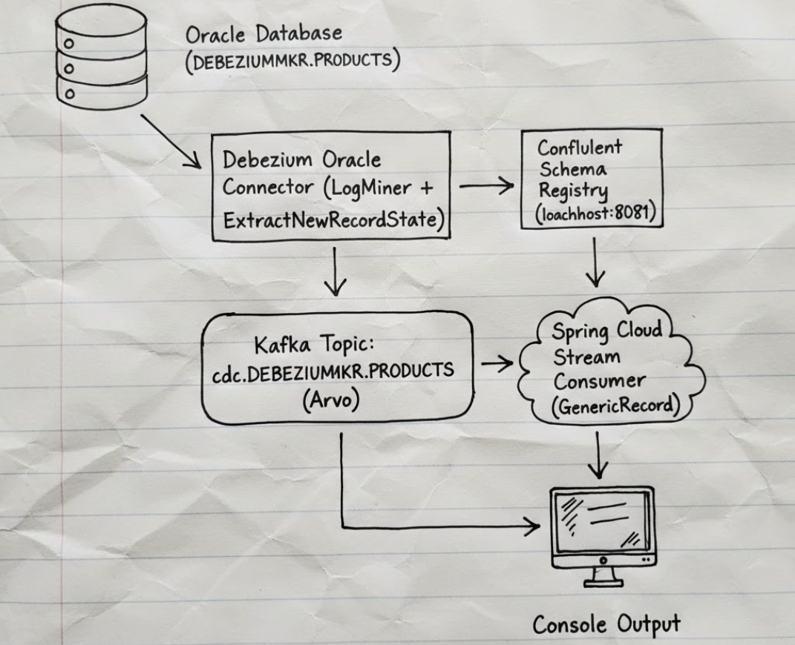

Kafka Streams – Debezium Oracle CDC with Spring Cloud Stream

This project is a Spring Boot application that consumes Change Data Capture (CDC) events from an Oracle Database using Debezium, Apache Kafka, and Spring Cloud Stream.
The application processes Avro-encoded CDC events and logs them to the console.

📐 Architecture
```
Oracle Database (DEBEZIUMMKR.PRODUCTS)
        ↓
Debezium Oracle Connector (LogMiner + ExtractNewRecordState)
        ↓
Kafka Topic: cdc.DEBEZIUMMKR.PRODUCTS (Avro)
        ↓
Confluent Schema Registry (localhost:8081)
        ↓
Spring Cloud Stream Consumer (GenericRecord)
        ↓
Console Output

```


✅ Prerequisites

    Ensure the following are installed and configured:
    - Java 21+
    - Docker & Docker Compose
    - Gradle
    - Oracle Database with LogMiner enabled

🧰 Tech Stack

    - Spring Boot 3.x
    - Spring Cloud Stream
    - Apache Kafka
    - Confluent Schema Registry
    - Apache Avro
    - Debezium Oracle Connector

📁 Project Structure
```
kafkastream/
├── build.gradle
├── docker-compose.yaml
└── src/
    └── main/
        ├── java/
        │   └── co/istad/makara/kafkastream/
        │       ├── KafkastreamApplication.java
        │       └── stream/
        │           ├── StreamConfig.java
        │           └── Product.java
        └── resources/
            └── application.yaml
```
🔄 Stream Functions

| Bean Name              | Type                         | Description                                          |
| ---------------------- | ---------------------------- | ---------------------------------------------------- |
| `processOracleMessage` | `Consumer<GenericRecord>`    | Consumes CDC events from Oracle via Debezium         |
| `processProductDetail` | `Function<Product, Product>` | Transforms `Product` and produces to an output topic |
| `processProduct`       | `Consumer<Product>`          | Consumes `Product` objects                           |
| `processMessage`       | `Consumer<String>`           | Simple string consumer                               |

⚙️ Configuration

    application.yaml
```yaml
spring:
  application:
    name: kafkastream

  cloud:
    function:
      definition: processOracleMessage

    stream:
      kafka:
        binder:
          brokers: localhost:29092,localhost:29094,localhost:29096

        bindings:
          processOracleMessage-in-0:
            consumer:
              configuration:
                schema.registry.url: http://localhost:8081
                key.deserializer: io.confluent.kafka.serializers.KafkaAvroDeserializer
                value.deserializer: io.confluent.kafka.serializers.KafkaAvroDeserializer
                specific.avro.reader: false

      bindings:
        processOracleMessage-in-0:
          destination: cdc.DEBEZIUMMKR.PRODUCTS
          group: oracle-monitor-group
          content-type: application/*+avro

```
🚀 Getting Started

    1️⃣ Start Infrastructure
```
docker-compose up -d
```
2️⃣ Create Debezium Oracle Connector

```
curl -X POST http://localhost:8083/connectors \
-H "Content-Type: application/json" \
-d '{
  "name": "oracle-connector-for-kafka-stream",
  "config": {
    "connector.class": "io.debezium.connector.oracle.OracleConnector",
    "database.hostname": "oracle-itp",
    "database.port": "1521",
    "database.user": "c##dbzuser",
    "database.password": "dbz",
    "database.dbname": "ORCLCDB",
    "database.pdb.name": "ORCLPDB1",
    "topic.prefix": "cdc",
    "table.include.list": "DEBEZIUMMKR.PRODUCTS",

    "schema.history.internal.kafka.bootstrap.servers": "kafka1:9092",
    "schema.history.internal.kafka.topic": "schema-changes.inventory",

    "key.converter": "io.confluent.connect.avro.AvroConverter",
    "key.converter.schema.registry.url": "http://schema-registry:8081",
    "value.converter": "io.confluent.connect.avro.AvroConverter",
    "value.converter.schema.registry.url": "http://schema-registry:8081",

    "transforms": "unwrap",
    "transforms.unwrap.type": "io.debezium.transforms.ExtractNewRecordState"
  }
}'

```

3️⃣ Test CDC
```
INSERT INTO DEBEZIUMMKR.PRODUCTS (ID, NAME, DESCRIPTION, WEIGHT)
VALUES ('1', 'scooter', 'Small 2-wheel scooter', '3.14');

COMMIT;

```